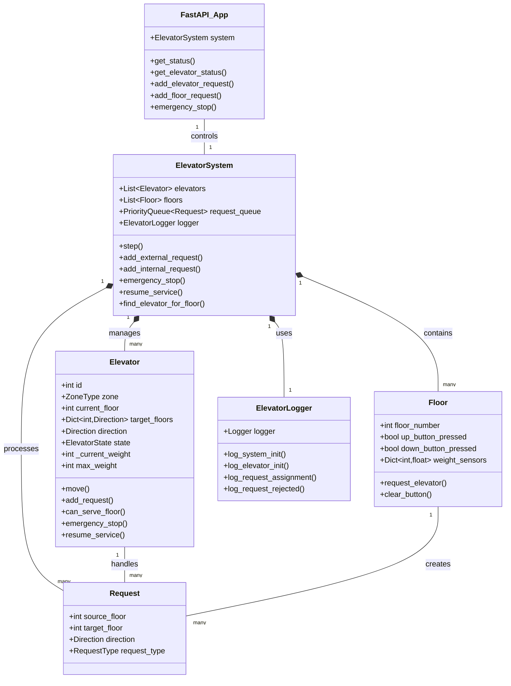
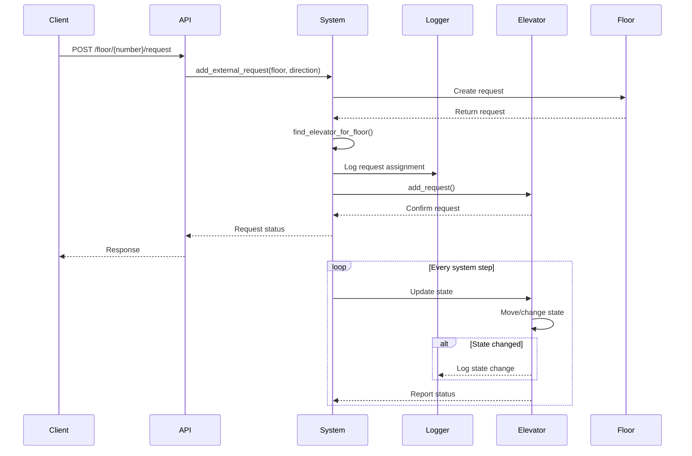
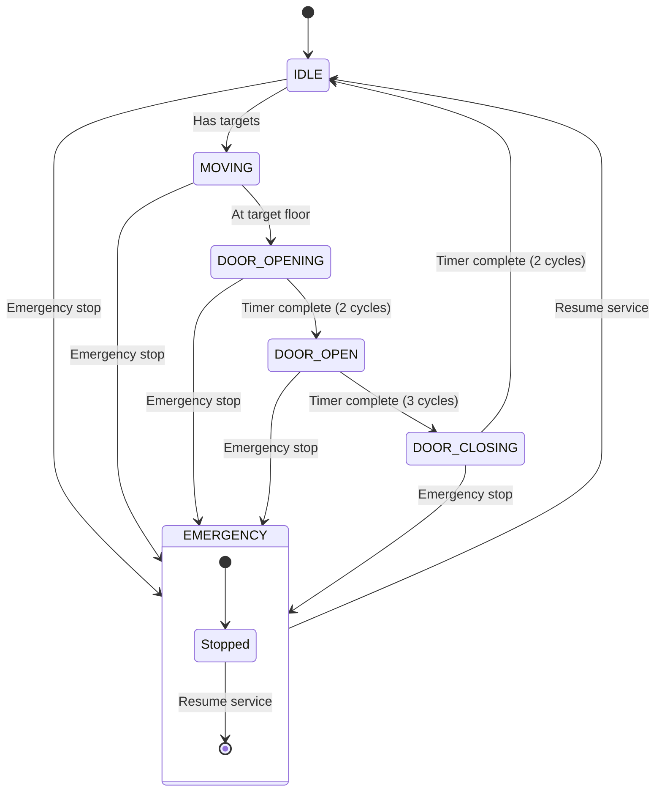
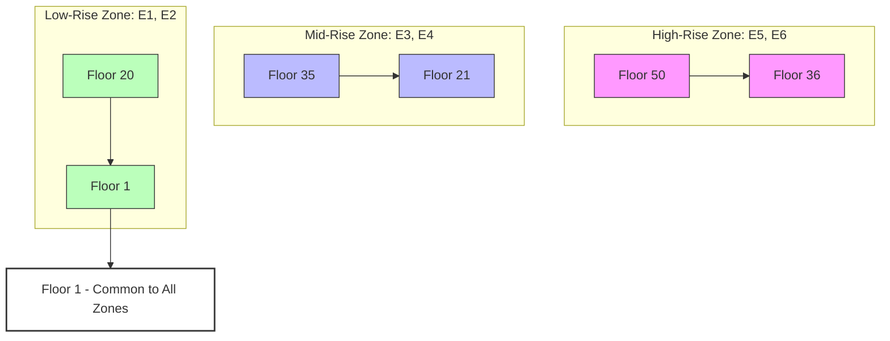

# Elevator System Architecture

This document outlines the architecture of the elevator system, including component relationships, data flow, and state management.

## System Components



## Request Flow



## State Management



## Zone Configuration



## API Structure

```mermaid
graph LR
    subgraph API Endpoints
        GET_STATUS[/system/status]
        GET_ELEVATOR[/elevator/{id}/status]
        POST_ELEVATOR[/elevator/{id}/request]
        POST_FLOOR[/floor/{number}/request]
        POST_EMERGENCY[/system/emergency]
        RESUME[/system/resume]
    end
    
    subgraph System Components
        SYSTEM[ElevatorSystem]
        CACHE[Status Cache<br>TTL: 100ms]
        LOGGER[ElevatorLogger]
    end
    
    GET_STATUS --> CACHE
    CACHE --> SYSTEM
    GET_ELEVATOR --> SYSTEM
    POST_ELEVATOR --> SYSTEM
    POST_FLOOR --> SYSTEM
    POST_EMERGENCY --> SYSTEM
    RESUME --> SYSTEM
    
    SYSTEM --> LOGGER
```

## Key Components

1. **ElevatorSystem**
   - Central coordinator for all elevators
   - Manages request distribution using priority queue
   - Handles zone-based operations
   - Coordinates emergency operations
   - Maintains system-wide logging

2. **Elevator**
   - Manages individual elevator state
   - Handles movement and door operations
   - Maintains target floor queue
   - Enforces zone restrictions
   - Weight limit: 2200 pounds
   - Door timing controls

3. **Floor**
   - Tracks up/down button states
   - Creates elevator requests
   - Manages weight sensors
   - Handles direction indicators

4. **Request**
   - Represents elevator calls
   - Contains source and target floors
   - Specifies direction and type
   - Supports request prioritization
   - Internal requests have priority

5. **API Layer**
   - FastAPI implementation
   - Status caching (100ms TTL)
   - Request validation
   - Error handling
   - Swagger documentation

6. **Logger**
   - Session-based logging
   - State change tracking
   - Request logging
   - Error logging
   - Console and file output

## Implementation Notes

1. **State Management**
   - Each elevator maintains independent state
   - States: IDLE, MOVING, DOOR_OPEN, DOOR_CLOSING, DOOR_OPENING, EMERGENCY
   - Door operations use cycle-based timers:
     - Opening: 2 cycles
     - Open: 3 cycles
     - Closing: 2 cycles

2. **Request Handling**
   - External requests from floor buttons
   - Internal requests from elevator buttons
   - Priority queue for request management
   - Zone restrictions strictly enforced
   - Special handling for lobby (Floor 1)

3. **Zone System**
   - Three zones with two elevators each:
     - Low-rise: Floors 1-20 (E1, E2)
     - Mid-rise: Floors 21-35 (E3, E4)
     - High-rise: Floors 36-50 (E5, E6)
   - Floor 1 accessible by all elevators
   - Strict zone enforcement otherwise

4. **Safety Features**
   - Emergency stop capability
   - Weight limit monitoring
   - Door timing controls
   - Zone restrictions
   - Request validation
   - Comprehensive logging 