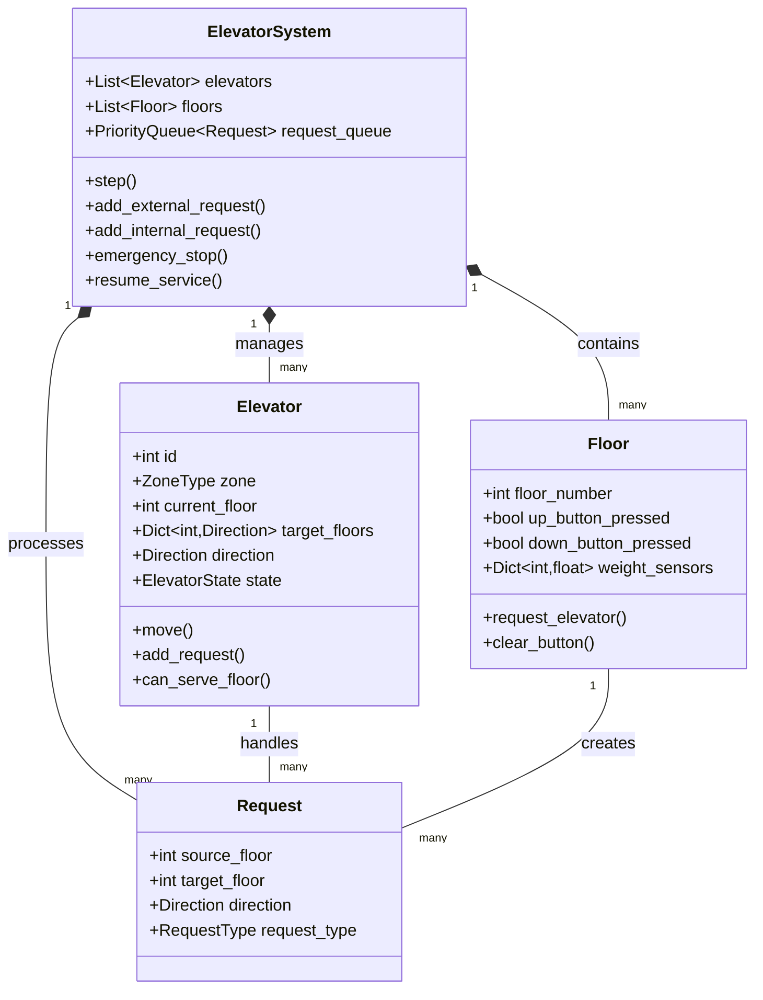
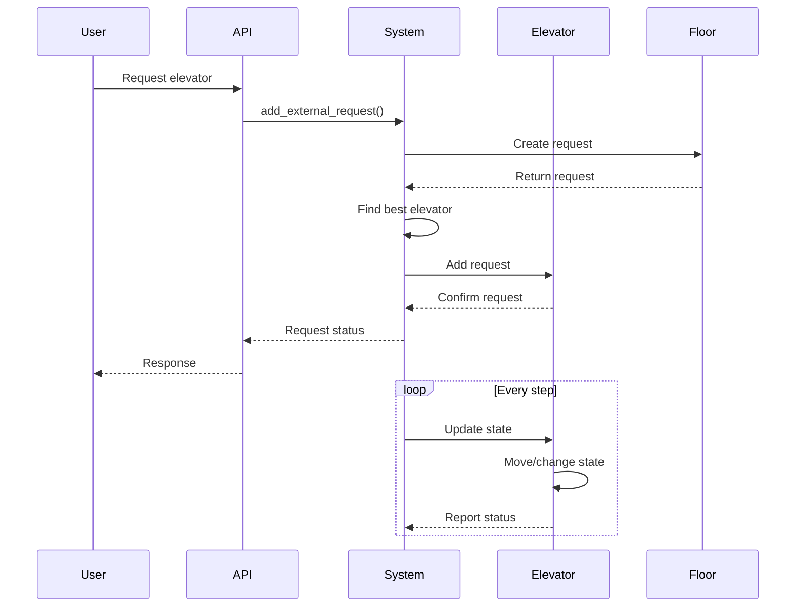
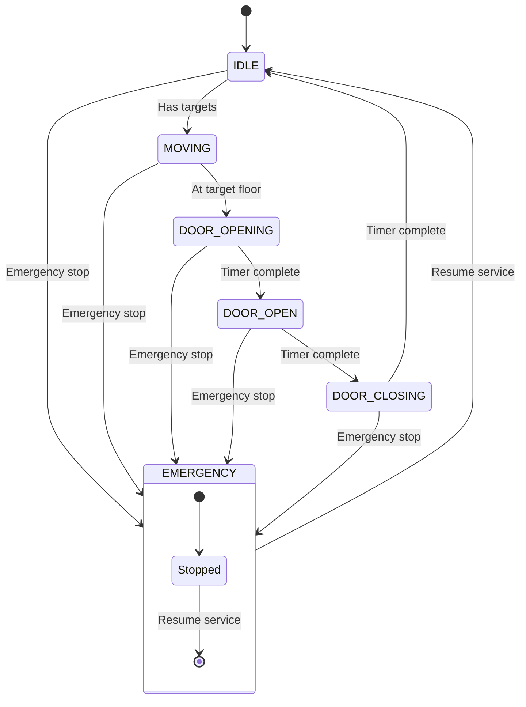
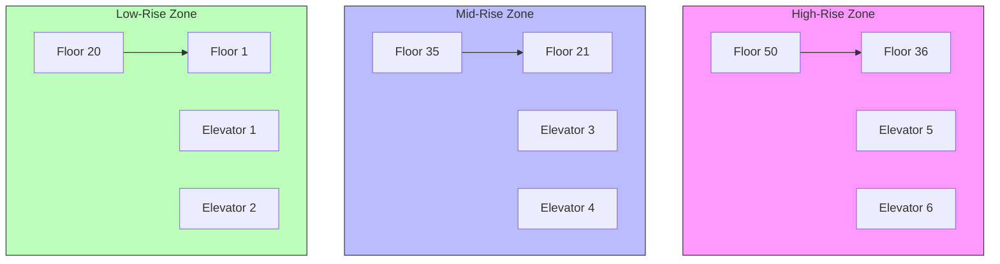

# Elevator System Architecture

This document outlines the architecture of the elevator system, including component relationships, data flow, and state management.

## System Components



## Request Flow



## State Management



## Zone Configuration



## API Structure

```mermaid
graph LR
    subgraph API Endpoints
        GET_STATUS[/system/status]
        GET_ELEVATOR[/elevator/{id}/status]
        POST_ELEVATOR[/elevator/{id}/request]
        POST_FLOOR[/floor/{number}/request]
        POST_EMERGENCY[/system/emergency]
    end
    
    subgraph System
        SYSTEM[ElevatorSystem]
        CACHE[Status Cache]
    end
    
    GET_STATUS --> CACHE
    CACHE --> SYSTEM
    GET_ELEVATOR --> SYSTEM
    POST_ELEVATOR --> SYSTEM
    POST_FLOOR --> SYSTEM
    POST_EMERGENCY --> SYSTEM
```

## Key Components

1. **ElevatorSystem**
   - Central coordinator for all elevators
   - Manages request distribution
   - Handles zone-based operations
   - Coordinates emergency operations

2. **Elevator**
   - Manages individual elevator state
   - Handles movement and door operations
   - Maintains target floor queue
   - Enforces zone restrictions

3. **Floor**
   - Tracks button states
   - Creates elevator requests
   - Manages weight sensors
   - Handles direction indicators

4. **Request**
   - Represents elevator calls
   - Contains source and target floors
   - Specifies direction and type
   - Supports request prioritization

5. **API Layer**
   - Provides RESTful endpoints
   - Implements status caching
   - Handles real-time updates
   - Manages system control

## Implementation Notes

1. **State Management**
   - Each elevator maintains its own state
   - States include: IDLE, MOVING, DOOR_OPEN, DOOR_CLOSING, DOOR_OPENING, EMERGENCY
   - State transitions are timer-controlled for door operations

2. **Request Handling**
   - External requests come from floor buttons
   - Internal requests come from elevator buttons
   - Requests are prioritized based on type and direction
   - Zone restrictions are enforced during assignment

3. **Zone System**
   - Three zones: Low-rise, Mid-rise, High-rise
   - Two elevators per zone
   - All elevators can serve lobby (Floor 1)
   - Strict zone enforcement otherwise

4. **Safety Features**
   - Emergency stop capability
   - Weight limits
   - Door timing controls
   - Zone restrictions
   - Request validation 